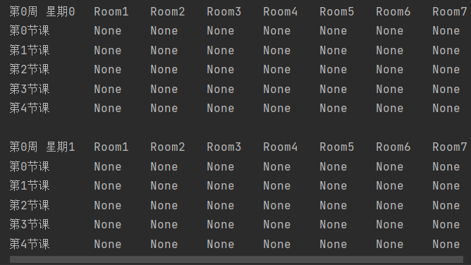
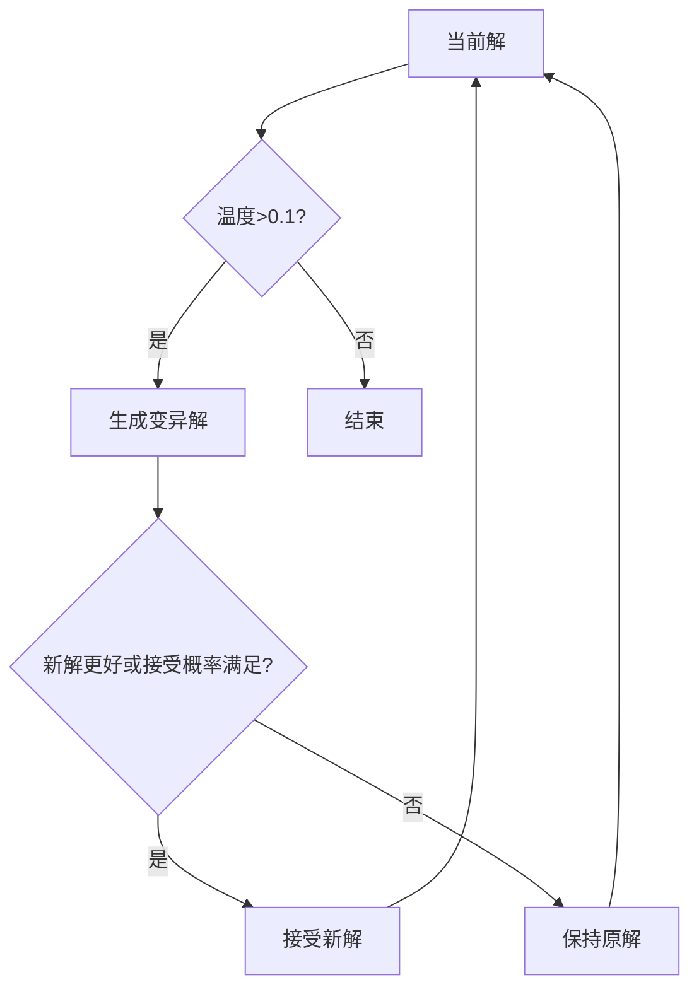

## 一、整体架构
该系统采用模拟退火算法解决课程排课问题，包含以下核心模块：
1. **数据初始化**：构建空闲时间表和课表矩阵
2. **规则检查**：时间冲突检测和教学时长限制
3. **初始排课生成**：基于笛卡尔积的随机排课
4. **软约束优化**：连堂课惩罚机制
5. **模拟退火算法**：全局搜索优化排课方案

## 二、函数讲解

**init_data函数：**
- 创建了一个包含所有可能时间段的列表empty_time，每个时间段由周次、星期几、课时组成。
使用字典为每个班级、老师和教室分配初始的空闲时间列表。这里需要注意使用.copy()来避免引用共享的问题。
构建一个四维的numpy数组matrix（结构如图），用于存储课表信息，结构为[第几周][星期几][第几节课][教室号]，每个元素保存班级、老师和课程名称。

**Less_than_six_hours函数：**
- 遍历指定时间段内的所有小时段，检查对应的班级或老师在该时间段内的累计时间是否超过6小时。这里的时间单位是每节课的2小时，因此超过3节课（6小时）就会触发返回True。

**cartesian_product函数：**
- 多层循环遍历所有可能的周次、星期几和课时组合。
随机选择一个班级和课程，检查该班级在指定时间段是否有空，以及是否符合时间限制。
根据课程类型选择合适的老师，优先考虑指定的老师，如果没有则随机选择有空闲的老师。
检查教室的容量和类型是否符合课程需求（理论课或实验课）。
安排课程后，更新课表矩阵、空闲时间列表，并记录到school_timetable中。
最后处理剩余未完成的课程，尝试找到合适的时间段进行安排。

**soft_constraint函数：**
- 统计所有班级和老师的连堂课次数，作为适应度指标。连堂课指的是同一教师或班级连续两节课都有安排的情况。

**show函数：**
- 按周次和星期几打印课表，每节课对应一个教室的位置，显示班级、老师和课程名称。

**variation函数：**
- 实现模拟退火的变异步骤，随机选择一个已存在的课程进行调整，尝试将其移动到其他时间段和教室。
检查新的安排是否合法（时间、教室、老师和班级是否可用），并更新相关数据结构。

## 三、代码过程
- （main.py） 数据准备 → 初始排课 → 未完成则随机分配 → 合法性检查 → 完成后进入优化 → 重复直到最优 → 导出课表（school_timetable.npy）
- (ask.py) 用于查询生成的课表（school_timetable.npy）

- 退火优化过程 

